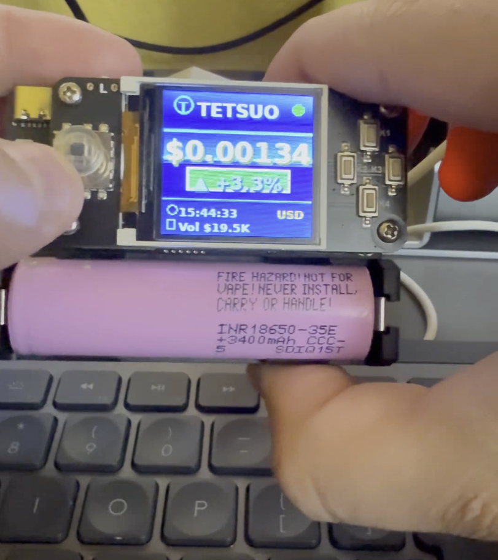
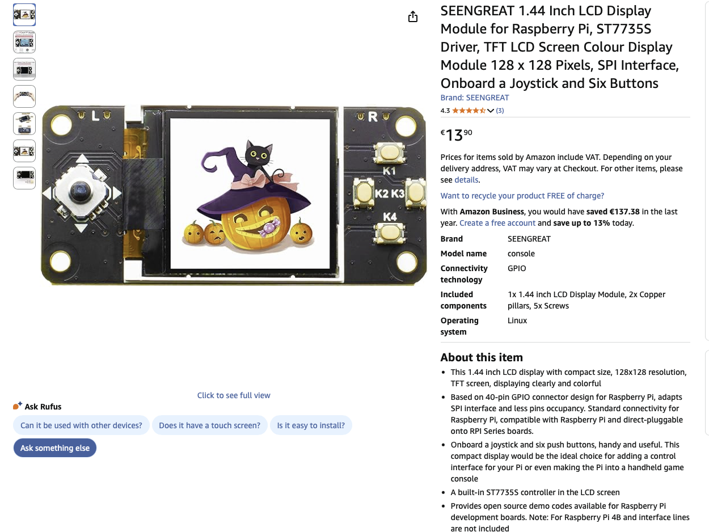
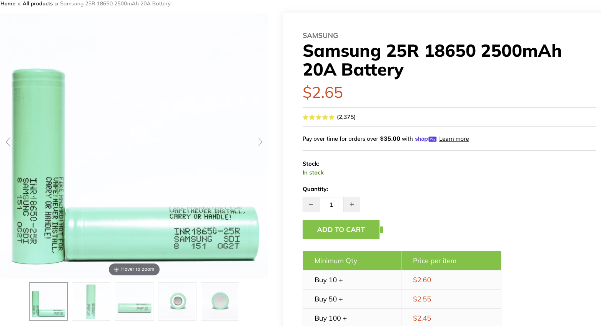
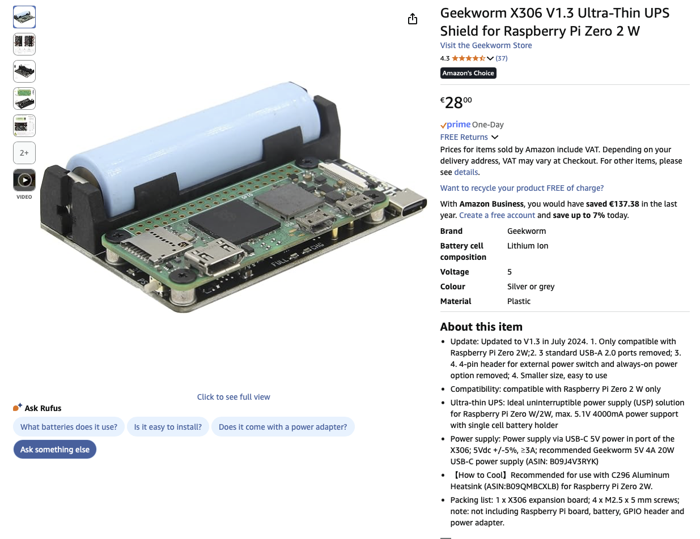

# TETSUO Display

A Raspberry Pi cryptocurrency price display system with support for e-ink and color LCD screens. Monitor real-time token prices, 24h changes, volume, and liquidity from multiple data sources.



**[📺 Watch Demo Video on X](https://x.com/d4rkpavel/status/1978458244147200181)**


## Features

- **Multi-Display Support**
  - Waveshare 2.7" E-Paper Display (264×176)
  - ST7735S 1.44" Color LCD Display (128×128)

- **Multi-Source Data Fetching**
  - DexScreener (primary)
  - Birdeye API
  - GeckoTerminal
  - Automatic fallback between sources

- **Hardware Integration**
  - 4 physical buttons for manual control
  - 5-way joystick for LCD navigation
  - SPI communication
  - GPIO-based controls

- **Smart Features**
  - Automatic pair resolution
  - Data caching for offline display
  - Configurable refresh rates
  - Partial vs. full display refresh optimization
  - Animated LCD interface with gradients

## Hardware Requirements

### E-Paper Display Setup
- Raspberry Pi (Zero W, 3, or 4)
- Waveshare 2.7" E-Paper HAT V2
- 4 GPIO buttons (optional)
- MicroSD card (8GB+)

### LCD Display Setup
- Raspberry Pi (Zero W, 3, or 4)
- ST7735S 1.44" Color LCD (128×128)
- 5-way joystick (optional)
- MicroSD card (8GB+)

## Hardware Gallery

<table>
  <tr>
    <td align="center">
      <br/>
      <b>LCD Display</b><br/>
      ST7735S 128×128 Color Display
    </td>
    <td align="center">
      <br/>
      <b>Raspberry Pi Zero 2 W</b><br/>
      Main Controller
    </td>
  </tr>
  <tr>
    <td align="center">
      <br/>
      <b>Battery Pack</b><br/>
      18650 Battery Holder
    </td>
    <td align="center">
      <br/>
      <b>Power Supply</b><br/>
      5V Power Module
    </td>
  </tr>
</table>

## Installation

### Quick Start

```bash
# Clone the repository
git clone https://github.com/TETSUO-FirmwareForge/tetsuo-display.git
cd tetsuo-display

# Run the installation script
bash install.sh

# Configure your token (interactive wizard)
python3 scripts/wizard.py

# Start the display
sudo python3 app/main.py --config config.yaml
```

### Manual Installation

```bash
# Update system packages
sudo apt update && sudo apt upgrade -y

# Install dependencies
sudo apt install -y python3-pip python3-pil python3-numpy \
  python3-spidev python3-rpi.gpio git

# Install Python packages
pip3 install -r requirements.txt

# Enable SPI interface
sudo raspi-config nonint do_spi 0

# Reboot
sudo reboot
```

## Configuration

### E-Paper Display (config.yaml)

```yaml
token:
  symbol: TETSUO
  chain: solana
  mint: YOUR_TOKEN_MINT_ADDRESS

primary:
  pair: YOUR_PAIR_ADDRESS  # Auto-filled by wizard

display:
  fiat: USD
  mode: normal  # or "blank" for white-screen mode

poll:
  interval_seconds: 6

refresh:
  full_every_minutes: 45
  full_after_partials: 60
```

### LCD Display (config_lcd.yaml)

Similar structure with LCD-specific GPIO pins and display settings.

### Environment Variables (.env)

```bash
BIRDEYE_API_KEY=your_api_key_here  # Optional
```

## Usage

### Run E-Paper Display

```bash
# Foreground mode
sudo python3 app/main.py --config config.yaml

# As systemd service
sudo systemctl start tetsuo-display
sudo systemctl enable tetsuo-display  # Auto-start on boot
```

### Run LCD Display

```bash
# Foreground mode
sudo python3 main_lcd.py

# As systemd service
sudo systemctl start tetsuo-lcd
sudo systemctl enable tetsuo-lcd
```

### Button Controls (E-Paper)

- **KEY1**: Force full display refresh
- **KEY2**: Show test pattern
- **KEY3**: Reserved
- **KEY4**: Manual data refresh

### Joystick Controls (LCD)

- **Left/Right**: Switch between crypto views
- **Up/Down**: Adjust brightness
- **Center**: Open menu

## Project Structure

```
tetsuo-display/
├── app/                      # Core application modules
│   ├── main.py              # E-paper daemon
│   ├── config.py            # Configuration loader
│   ├── data_fetcher.py      # Multi-source API fetcher
│   ├── renderer.py          # E-paper renderer
│   ├── display_driver.py    # E-paper hardware driver
│   ├── lcd_driver_st7735.py # LCD hardware driver
│   ├── lcd_renderer.py      # LCD GUI renderer
│   ├── buttons.py           # Button handler
│   ├── cache.py             # Data caching
│   └── pair_resolver.py     # Trading pair resolution
├── scripts/
│   └── wizard.py            # Setup wizard
├── tests/                   # Test suite
├── config.yaml              # E-paper configuration
├── config_lcd.yaml          # LCD configuration
├── requirements.txt         # Python dependencies
├── install.sh              # Installation script
├── deploy-to-pi.sh         # Deployment automation
└── *.service               # Systemd service files
```

## API Sources

The system fetches data from multiple sources with automatic fallback:

1. **DexScreener Pair** - Primary source (requires pair address)
2. **DexScreener Token** - First fallback (token mint only)
3. **Birdeye API** - Second fallback (requires API key)
4. **GeckoTerminal** - Final fallback (public API)

Data includes:
- Real-time price (USD)
- 24h price change (%)
- 24h volume
- Liquidity
- Fully Diluted Valuation (FDV)

## Display Layouts

### E-Paper Display (2.7")

```
┌────────────────────────────────┐
│  TETSUO (SOL)          [HEADER]│
├──────────────┬─────────────────┤
│              │   24h Change    │
│  $0.001617   │   ▲ +1.06%     │
│   [PRICE]    │   [CHANGE]      │
├──────────────┴─────────────────┤
│  Vol: $23.6K   Liq: $615K      │
│           [STATS]               │
├─────────────────────────────────┤
│  12:34 PM        [LIVE]  [FOOT]│
└─────────────────────────────────┘
```

### LCD Display (1.44")

Modern animated GUI with:
- Gradient backgrounds
- Real-time price updates
- Color-coded change indicators
- Multi-crypto switching
- Interactive menu system

## Development

### Running Tests

```bash
# Smoke tests
python3 tests/smoke_test.py

# Display tests (requires hardware)
python3 tests/display_test.py

# Layout verification
python3 tests/layout_proof.py
```

### Test LCD Display

```bash
# Quick color test
sudo python3 test_lcd.py --quick

# Full test suite
sudo python3 test_lcd.py
```

## Deployment

### Deploy to Raspberry Pi

```bash
# From your development machine
bash deploy-to-pi.sh
```

The script will:
1. Transfer all files to the Pi
2. Create directory structure
3. Install dependencies
4. Configure systemd service
5. Start the display

### Manual Deployment

See [QUICKSTART.md](QUICKSTART.md) for detailed manual deployment instructions.

## Troubleshooting

### Display Not Working

```bash
# Check SPI is enabled
ls /dev/spidev*

# Enable SPI if missing
sudo raspi-config
# Interface Options -> SPI -> Enable
sudo reboot
```

### Permission Denied

```bash
# Add user to required groups
sudo usermod -a -G gpio,spi,i2c $USER
# Logout and login again
```

### Service Not Starting

```bash
# Check service status
sudo systemctl status tetsuo-display

# View logs
sudo journalctl -u tetsuo-display -f
```

### API Errors

```bash
# Test data fetching
python3 -c "
from app.config import Config
from app.data_fetcher import DataFetcher
config = Config('config.yaml')
fetcher = DataFetcher(config)
data = fetcher.fetch()
print(f'Price: \${data.price_usd}')
"
```

## Performance

- Config load: <50ms
- Data fetch: 300-800ms (network dependent)
- Cache operations: <10ms
- Layout render: 100-200ms
- Display update: 2-4s (e-paper), <100ms (LCD)

## Contributing

Contributions welcome! Please:

1. Fork the repository
2. Create a feature branch
3. Make your changes
4. Test on actual hardware if possible
5. Submit a pull request

## License

This project is licensed under the MIT License - see the [LICENSE](LICENSE) file for details.

## Acknowledgments

- Built for the TETSUO community
- Waveshare for e-paper display libraries
- DexScreener, Birdeye, and GeckoTerminal for API access

## Support

For issues, questions, or suggestions:
- Open an issue on GitHub
- Check existing documentation
- Review test results in `TEST_RESULTS.md`

## Roadmap

- [ ] Multi-token carousel mode
- [ ] Price alerts via GPIO buzzer
- [ ] Historical price charts
- [ ] Web interface for configuration
- [ ] Support for additional display types
- [ ] Mobile app integration

---

**Made by TETSUO-FirmwareForge**
